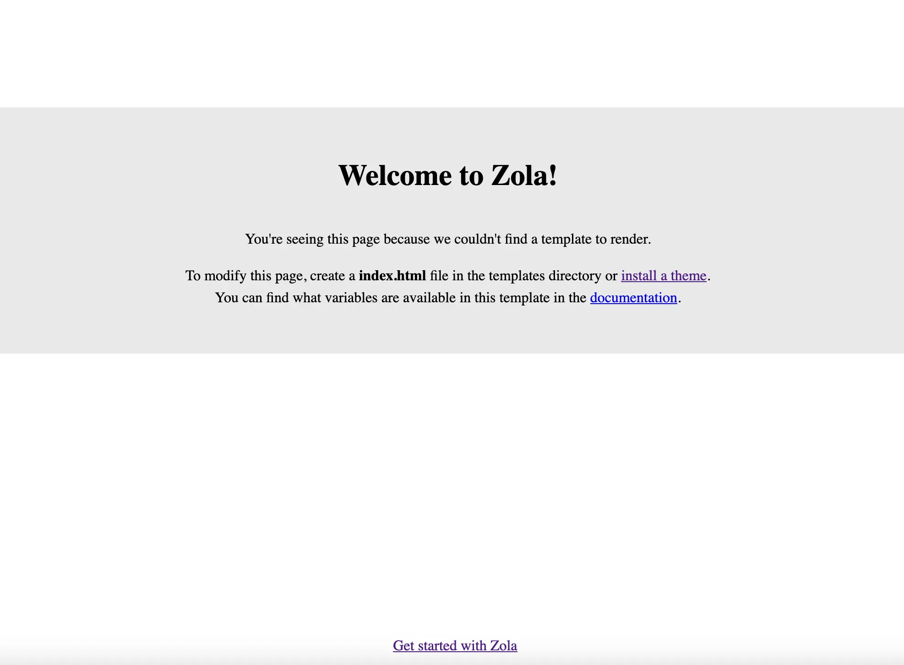
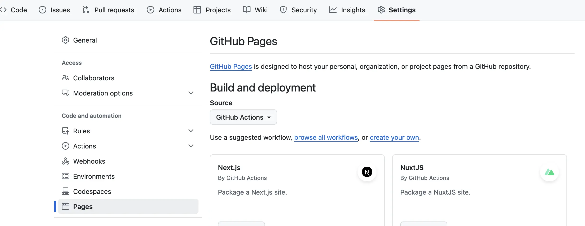

+++
title = "Publishing a Zola site to GitHub Pages with Nix and GitHub Actions"
date = 2024-09-11
description = "A comprehensive guide to setting up and deploying a Zola site using Nix and GitHub Actions"
[taxonomies]
categories = ["Meta"]
tags = ["meta", "zola", "nix", "github-actions"]
[extra]
lang = "en"
toc = true
mermaid = true
+++


> Escher, M.C. *Metamorphosis II*. 1939-1940. Woodcut printed from 20 blocks on 3 combined sheets. National Gallery of Art, Washington, D.C.

This article is a bit *meta*, but it explains how this blog is deployed and hosted. I use this setup because it's both powerful and convenient. Nix ensures that the site builds consistently on any machine. GitHub provides free hosting and automates the deployment process. Together, these tools make it easy to manage and update the site.

## What is Zola?

[Zola](https://www.getzola.org/) is a fast, flexible static site generator written in Rust. It takes your content, applies templates, and generates a complete static website ready to be served.

## Why this Setup?

1. **Consistent Environments**: Nix creates identical build environments on any machine.
2. **Automated Deployments**: GitHub Actions handle builds and deployments automatically.
3. **Free Hosting**: GitHub Pages hosts your site at no cost.
4. **Version Control**: Your site's content is version-controlled with Git.
5. **Modularity**: Content, site generation, build process, and deployment are separate, easing maintenance.

## Prerequisites 

- A [Nix](https://nixos.org/download/) Installation (The package manager or NixOS)
- A [GitHub](https://github.com/) Account
- Basic familiarity with [Git](https://git-scm.com/) and command-line operations

## Workflow

To better understand the entire process, let's look at a visual representation of the workflow:


flowchart LR
    A[Local Development] --> B[GitHub Repository]
    B --> C[GitHub Actions]
    C --> D[Build with Nix]
    D --> E[Deploy to GitHub Pages]
    E --> F[Site Live]

    A -->|Push Changes| B
    C -->|Triggered on Push| D

    style A fill:#f9d71c,stroke:#333,stroke-width:2px
    style C fill:#8da0cb,stroke:#333,stroke-width:2px
    style F fill:#66c2a5,stroke:#333,stroke-width:2px


Now, let's walk through each step to get your site live.

## Setup

### 1. Scaffolding a Zola project

First, let's create a new Zola project:

```sh
nix shell nixpkgs#zola -c zola init my-zola-site
cd my-zola-site
```

This command creates a new Zola project named ```my-zola-site```. The Zola CLI will ask you some setup questions. Don't worry too much about your choices; you can always change them later in ```config.toml```.

After setup, your project structure should look like this:

```sh
.
├── config.toml
├── content
├── static
├── templates
└── themes
```

To see your site locally, run:

```sh
nix shell nixpkgs#zola -c zola serve
```

Visit the URL printed in your terminal (usually http://127.0.0.1:1111) to see your new Zola site:




By default Zola will serve on ```http://127.0.0.1:1111```, but you can change the interface and port with the ```--interface``` and ```--port``` flags respectively.


### 2. Setting up a Nix Flake

Create a file named ```flake.nix``` in your project root with the following content:


```nix,linenos
{
  description = "Zola site built with Nix";

  inputs = {
    nixpkgs.url = "github:NixOS/nixpkgs/nixos-unstable";
    flake-utils.url = "github:numtide/flake-utils";
  };

  outputs = { self, nixpkgs, flake-utils }:
    flake-utils.lib.eachDefaultSystem (system:
      let
        pkgs = nixpkgs.legacyPackages.${system};
      in
      {
        devShells.default = pkgs.mkShell {
          buildInputs = [ pkgs.zola ];
        };

        packages.default = pkgs.stdenv.mkDerivation {
          name = "example"; # replace me
          src = self;
          buildInputs = [ pkgs.zola ];
          buildPhase = "zola build";
          installPhase = "cp -r public $out";
        };
      }
    );
}
```


This flake defines both a development environment and a build process for your Zola site.

 

Let's break down the key parts of this Nix flake:

1. **Description**: A brief description of the flake's purpose.
2. **Inputs**:
    - ```nixpkgs```: The main Nix packages repository.
    - ```flake-utils```: A utility library for writing flakes.
3. **Outputs**: This function defines what the flake produces.
    - It uses ```flake-utils``` to generate outputs for each default system.
    - ```devShells.default```: Defines a development environment with Zola installed.
    - ```packages.default```: Defines how to build the Zola site:
        - Uses the flake's own directory as the source.
        - Builds the site with ```zola build```.
        - Copies the ```public``` directory to the output.

This setup allows for consistent development and build environments across different machines.



To use the development environment:

```sh
nix develop
```

You should see that you now enter a ```bash``` environment. Now run:

```sh
zola serve
```

If this is successful, you will see the same output as we had above and should be able to navigate to the default Zola page.

To build the site:

```sh
nix build
```

### 3. GitHub Actions

Create a file at ```.github/workflows/publish.yml``` with the following content:


```yaml,linenos
name: Publish

on:
  push:
    branches: [main]
  workflow_dispatch:

permissions:
  contents: read
  pages: write
  id-token: write
  deployments: write

jobs:
  build:
    runs-on: ubuntu-latest
    steps:
      - name: Checkout
        uses: actions/checkout@main
        with:
          submodules: recursive
      - name: Install Nix
        uses: DeterminateSystems/nix-installer-action@main
      - name: Run the Magic Nix Cache
        uses: DeterminateSystems/magic-nix-cache-action@main
      - name: Build with Nix
        run: |
          nix build '.?submodules=1#' 
      - name: Upload artifact
        uses: actions/upload-pages-artifact@main
        with:
          path: ./result

  deploy-production:
    environment:
      name: github-pages
      url: ${{ steps.deployment.outputs.page_url }}
    runs-on: ubuntu-latest
    needs: build
    if: github.ref == 'refs/heads/main'
    steps:
      - name: Deploy to GitHub Pages
        id: deployment
        uses: actions/deploy-pages@main
```


This workflow builds your site using Nix and deploys it to GitHub Pages whenever you push to the ```main``` branch.

 

Let's break down the key components of this GitHub Actions workflow:

1. **Triggers**: The workflow runs on pushes to the ```main``` branch and can be manually triggered.
2. **Permissions**: Sets necessary permissions for GitHub Pages deployment.
3. **Jobs**:
    - **build**:
        - Checks out the repository with submodules (important for themes).
        - Installs Nix using a third-party action.
        - Builds the site using our Nix configuration.
        - Uploads the built site as an artifact.
    - **deploy**:
        - Runs only after the build job succeeds.
        - Deploys the built site to GitHub Pages.


This workflow automates the entire process from pushing changes to your repository to having those changes live on your site.

 Note the ```submodules: recursive``` parameter in the checkout step and also the flag ```'.?submodules=1#'``` passed in ```nix build```. This is crucial if you're using a Zola theme as a Git submodule, ensuring it's properly included in the build. 


### 4. GitHub Pages

In your GitHub repository settings, under "Pages", set the source to "GitHub Actions".



## Deployment

To deploy your site:

1. Commit your changes
2. Push to your GitHub repository
3. GitHub Actions will automatically build and deploy your site

You can monitor the deployment in the "Actions" tab of your GitHub repository.

## Customization

To customize your Zola site:

1. **Theme**: Choose a theme from the [Zola themes gallery](https://www.getzola.org/themes/)
2. **Configuration**: Edit ```config.toml``` for site-wide settings
3. **Content**: Add Markdown files to the ```content``` directory
4. **Templates**: Customize HTML structure in the ```templates``` directory
5. **Static Files**: Add images, CSS, or JavaScript to the ```static``` directory

Always test changes locally with ```zola serve``` before pushing to GitHub.

## Conclusion

You now have a Zola site that automatically builds and deploys to GitHub Pages using Nix and GitHub Actions. This setup provides reproducible builds, automated deployments, and free hosting.

The [source code for this site]((https://github.com/21CSM/21csm.github.io)) can serve as a reference for your own projects.

## Further Reading

- [Zola Documentation](https://www.getzola.org/documentation/getting-started/overview/)
- [Nix Manual](https://nixos.org/manual/nix/stable/)
- [GitHub Actions Documentation](https://docs.github.com/en/actions)
- [Markdown Guide](https://www.markdownguide.org/)
- [Learn Tera Templating](https://tera.netlify.app/docs/)